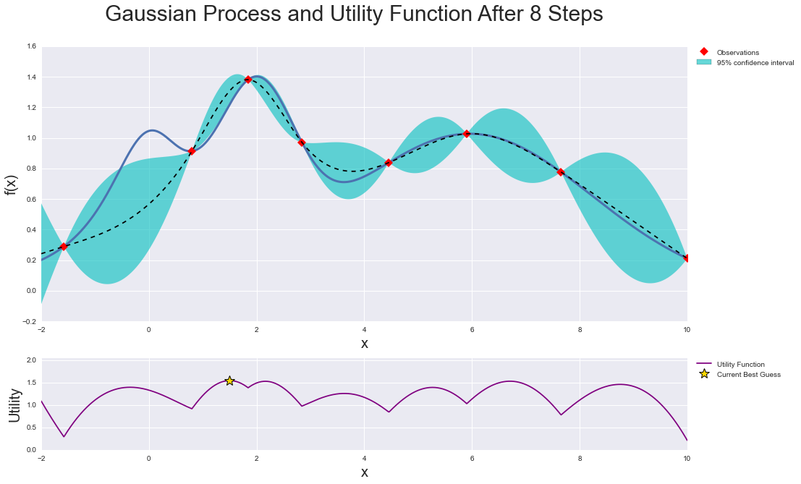
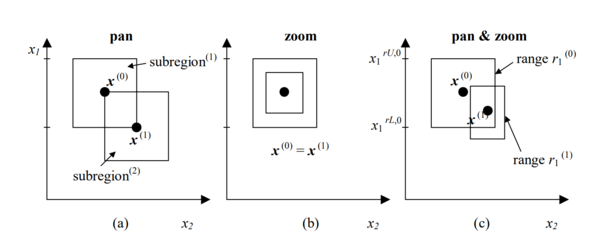

<div align="center">
  <br><br>
</div>

# Bayesian Optimization

[](https://travis-ci.org/fmfn/BayesianOptimization)
[](https://codecov.io/github/fmfn/BayesianOptimization?branch=master)
[](https://pypi.python.org/pypi/bayesian-optimization)

Pure Python implementation of bayesian global optimization with gaussian
processes.

* PyPI (pip):

```console
$ pip install bayesian-optimization
```

* Conda from conda-forge channel:

```console
$ conda install -c conda-forge bayesian-optimization
```

This is a constrained global optimization package built upon bayesian inference
and gaussian process, that attempts to find the maximum value of an unknown
function in as few iterations as possible. This technique is particularly
suited for optimization of high cost functions, situations where the balance
between exploration and exploitation is important.

## Quick Start
See below for a quick tour over the basics of the Bayesian Optimization package. More detailed information, other advanced features, and tips on usage/implementation can be found in the [examples](https://github.com/fmfn/BayesianOptimization/tree/master/examples) folder. I suggest that you:
- Follow the
[basic tour notebook](https://github.com/fmfn/BayesianOptimization/blob/master/examples/basic-tour.ipynb)
to learn how to use the package's most important features.
- Take a look at the
[advanced tour notebook](https://github.com/fmfn/BayesianOptimization/blob/master/examples/advanced-tour.ipynb)
to learn how to make the package more flexible, how to deal with categorical parameters, how to use observers, and more.
- Check out this
[notebook](https://github.com/fmfn/BayesianOptimization/blob/master/examples/visualization.ipynb)
with a step by step visualization of how this method works.
- Explore this [notebook](https://github.com/fmfn/BayesianOptimization/blob/master/examples/exploitation_vs_exploration.ipynb)
exemplifying the balance between exploration and exploitation and how to
control it.
- Go over this [script](https://github.com/fmfn/BayesianOptimization/blob/master/examples/sklearn_example.py)
for examples of how to tune parameters of Machine Learning models using cross validation and bayesian optimization.
- Explore the [domain reduction notebook](https://github.com/fmfn/BayesianOptimization/blob/master/examples/domain_reduction.ipynb) to learn more about how search can be sped up by dynamically changing parameters' bounds.
- Finally, take a look at this [script](https://github.com/fmfn/BayesianOptimization/blob/master/examples/async_optimization.py)
for ideas on how to implement bayesian optimization in a distributed fashion using this package.


## How does it work?

Bayesian optimization works by constructing a posterior distribution of functions (gaussian process) that best describes the function you want to optimize. As the number of observations grows, the posterior distribution improves, and the algorithm becomes more certain of which regions in parameter space are worth exploring and which are not, as seen in the picture below.



As you iterate over and over, the algorithm balances its needs of exploration and exploitation taking into account what it knows about the target function. At each step a Gaussian Process is fitted to the known samples (points previously explored), and the posterior distribution, combined with a exploration strategy (such as UCB (Upper Confidence Bound), or EI (Expected Improvement)), are used to determine the next point that should be explored (see the gif below).


This process is designed to minimize the number of steps required to find a combination of parameters that are close to the optimal combination. To do so, this method uses a proxy optimization problem (finding the maximum of the acquisition function) that, albeit still a hard problem, is cheaper (in the computational sense) and common tools can be employed. Therefore Bayesian Optimization is most adequate for situations where sampling the function to be optimized is a very expensive endeavor. See the references for a proper discussion of this method.

This project is under active development, if you find a bug, or anything that
needs correction, please let me know.


Basic tour of the Bayesian Optimization package
===============================================

## 1. Specifying the function to be optimized

This is a function optimization package, therefore the first and most important ingredient is, of course, the function to be optimized.

**DISCLAIMER:** We know exactly how the output of the function below depends on its parameter. Obviously this is just an example, and you shouldn't expect to know it in a real scenario. However, it should be clear that you don't need to. All you need in order to use this package (and more generally, this technique) is a function `f` that takes a known set of parameters and outputs a real number.


```python
def black_box_function(x, y):
    """Function with unknown internals we wish to maximize.

    This is just serving as an example, for all intents and
    purposes think of the internals of this function, i.e.: the process
    which generates its output values, as unknown.
    """
    return -x ** 2 - (y - 1) ** 2 + 1
```

## 2. Getting Started

All we need to get started is to instantiate a `BayesianOptimization` object specifying a function to be optimized `f`, and its parameters with their corresponding bounds, `pbounds`. This is a constrained optimization technique, so you must specify the minimum and maximum values that can be probed for each parameter in order for it to work


```python
from bayes_opt import BayesianOptimization

# Bounded region of parameter space
pbounds = {'x': (2, 4), 'y': (-3, 3)}

optimizer = BayesianOptimization(
    f=black_box_function,
    pbounds=pbounds,
    random_state=1,
)
```

The BayesianOptimization object will work out of the box without much tuning needed. The main method you should be aware of is `maximize`, which does exactly what you think it does.

There are many parameters you can pass to maximize, nonetheless, the most important ones are:
- `n_iter`: How many steps of bayesian optimization you want to perform. The more steps the more likely to find a good maximum you are.
- `init_points`: How many steps of **random** exploration you want to perform. Random exploration can help by diversifying the exploration space.


```python
optimizer.maximize(
    init_points=2,
    n_iter=3,
)
```

    |   iter    |  target   |     x     |     y     |
    -------------------------------------------------
    |  1        | -7.135    |  2.834    |  1.322    |
    |  2        | -7.78     |  2.0      | -1.186    |
    |  3        | -19.0     |  4.0      |  3.0      |
    |  4        | -16.3     |  2.378    | -2.413    |
    |  5        | -4.441    |  2.105    | -0.005822 |
    =================================================


The best combination of parameters and target value found can be accessed via the property `optimizer.max`.


```python
print(optimizer.max)
>>> {'target': -4.441293113411222, 'params': {'y': -0.005822117636089974, 'x': 2.104665051994087}}
```


While the list of all parameters probed and their corresponding target values is available via the property `optimizer.res`.


```python
for i, res in enumerate(optimizer.res):
    print("Iteration {}: \n\t{}".format(i, res))

>>> Iteration 0:
>>>     {'target': -7.135455292718879, 'params': {'y': 1.3219469606529488, 'x': 2.8340440094051482}}
>>> Iteration 1:
>>>     {'target': -7.779531005607566, 'params': {'y': -1.1860045642089614, 'x': 2.0002287496346898}}
>>> Iteration 2:
>>>     {'target': -19.0, 'params': {'y': 3.0, 'x': 4.0}}
>>> Iteration 3:
>>>     {'target': -16.29839645063864, 'params': {'y': -2.412527795983739, 'x': 2.3776144540856503}}
>>> Iteration 4:
>>>     {'target': -4.441293113411222, 'params': {'y': -0.005822117636089974, 'x': 2.104665051994087}}
```


### 2.1 Changing bounds

During the optimization process you may realize the bounds chosen for some parameters are not adequate. For these situations you can invoke the method `set_bounds` to alter them. You can pass any combination of **existing** parameters and their associated new bounds.


```python
optimizer.set_bounds(new_bounds={"x": (-2, 3)})

optimizer.maximize(
    init_points=0,
    n_iter=5,
)
```

    |   iter    |  target   |     x     |     y     |
    -------------------------------------------------
    |  6        | -5.145    |  2.115    | -0.2924   |
    |  7        | -5.379    |  2.337    |  0.04124  |
    |  8        | -3.581    |  1.874    | -0.03428  |
    |  9        | -2.624    |  1.702    |  0.1472   |
    |  10       | -1.762    |  1.442    |  0.1735   |
    =================================================

### 2.2 Sequential Domain Reduction

Sometimes the initial boundaries specified for a problem are too wide, and adding points to improve the response surface in regions of the solution domain is extraneous. Other times the cost function is very expensive to compute, and minimizing the number of calls is extremely beneficial.

When it's worthwhile to converge on an optimal point quickly rather than try to find the optimal point, contracting the domain around the current optimal value as the search progresses can speed up the search progress considerably. Using the `SequentialDomainReductionTransformer` the bounds of the problem can be panned and zoomed dynamically in an attempt to improve convergence.



An example of using the `SequentialDomainReductionTransformer` is shown in the [domain reduction notebook](https://github.com/fmfn/BayesianOptimization/blob/master/examples/domain_reduction.ipynb). More information about this method can be found in the paper ["On the robustness of a simple domain reduction scheme for simulation‐based optimization"](http://www.truegrid.com/srsm_revised.pdf).

## 3. Guiding the optimization

It is often the case that we have an idea of regions of the parameter space where the maximum of our function might lie. For these situations the `BayesianOptimization` object allows the user to specify points to be probed. By default these will be explored lazily (`lazy=True`), meaning these points will be evaluated only the next time you call `maximize`. This probing process happens before the gaussian process takes over.

Parameters can be passed as dictionaries or as an iterable.

```python
optimizer.probe(
    params={"x": 0.5, "y": 0.7},
    lazy=True,
)

optimizer.probe(
    params=[-0.3, 0.1],
    lazy=True,
)

# Will probe only the two points specified above
optimizer.maximize(init_points=0, n_iter=0)
```

    |   iter    |  target   |     x     |     y     |
    -------------------------------------------------
    |  11       |  0.66     |  0.5      |  0.7      |
    |  12       |  0.1      | -0.3      |  0.1      |
    =================================================


## 4. Saving, loading and restarting

By default you can follow the progress of your optimization by setting `verbose>0` when instantiating the `BayesianOptimization` object. If you need more control over logging/alerting you will need to use an observer. For more information about observers checkout the advanced tour notebook. Here we will only see how to use the native `JSONLogger` object to save to and load progress from files.

### 4.1 Saving progress


```python
from bayes_opt.logger import JSONLogger
from bayes_opt.event import Events
```

The observer paradigm works by:
1. Instantiating an observer object.
2. Tying the observer object to a particular event fired by an optimizer.

The `BayesianOptimization` object fires a number of internal events during optimization, in particular, everytime it probes the function and obtains a new parameter-target combination it will fire an `Events.OPTIMIZATION_STEP` event, which our logger will listen to.

**Caveat:** The logger will not look back at previously probed points.


```python
logger = JSONLogger(path="./logs.json")
optimizer.subscribe(Events.OPTIMIZATION_STEP, logger)

# Results will be saved in ./logs.json
optimizer.maximize(
    init_points=2,
    n_iter=3,
)
```

By default the previous data in the json file is removed. If you want to keep working with the same logger, the `reset` paremeter in `JSONLogger` should be set to False.

### 4.2 Loading progress

Naturally, if you stored progress you will be able to load that onto a new instance of `BayesianOptimization`. The easiest way to do it is by invoking the `load_logs` function, from the `util` submodule.


```python
from bayes_opt.util import load_logs


new_optimizer = BayesianOptimization(
    f=black_box_function,
    pbounds={"x": (-2, 2), "y": (-2, 2)},
    verbose=2,
    random_state=7,
)

# New optimizer is loaded with previously seen points
load_logs(new_optimizer, logs=["./logs.json"]);
```

## Next Steps

This introduction covered the most basic functionality of the package. Checkout the [basic-tour](https://github.com/fmfn/BayesianOptimization/blob/master/examples/basic-tour.ipynb) and [advanced-tour](https://github.com/fmfn/BayesianOptimization/blob/master/examples/advanced-tour.ipynb) notebooks in the example folder, where you will find detailed explanations and other more advanced functionality. Also, browse the examples folder for implementation tips and ideas.

Installation
============

### Installation

The latest release can be obtained by two ways:

* With PyPI (pip):

      pip install bayesian-optimization

* With conda (from conda-forge channel):

      conda install -c conda-forge bayesian-optimization

The bleeding edge version can be installed with:

    pip install git+https://github.com/fmfn/BayesianOptimization.git

If you prefer, you can clone it and run the setup.py file. Use the following
commands to get a copy from Github and install all dependencies:

    git clone https://github.com/fmfn/BayesianOptimization.git
    cd BayesianOptimization
    python setup.py install

Citation
============

If you used this package in your research and is interested in citing it here's how you do it:

```
@Misc{,
    author = {Fernando Nogueira},
    title = {{Bayesian Optimization}: Open source constrained global optimization tool for {Python}},
    year = {2014--},
    url = " https://github.com/fmfn/BayesianOptimization"
}
```

# Dependencies
* Numpy
* Scipy
* Scikit-learn

# References:
* http://papers.nips.cc/paper/4522-practical-bayesian-optimization-of-machine-learning-algorithms.pdf
* http://arxiv.org/pdf/1012.2599v1.pdf
* http://www.gaussianprocess.org/gpml/
* https://www.youtube.com/watch?v=vz3D36VXefI&index=10&list=PLE6Wd9FR--EdyJ5lbFl8UuGjecvVw66F6
